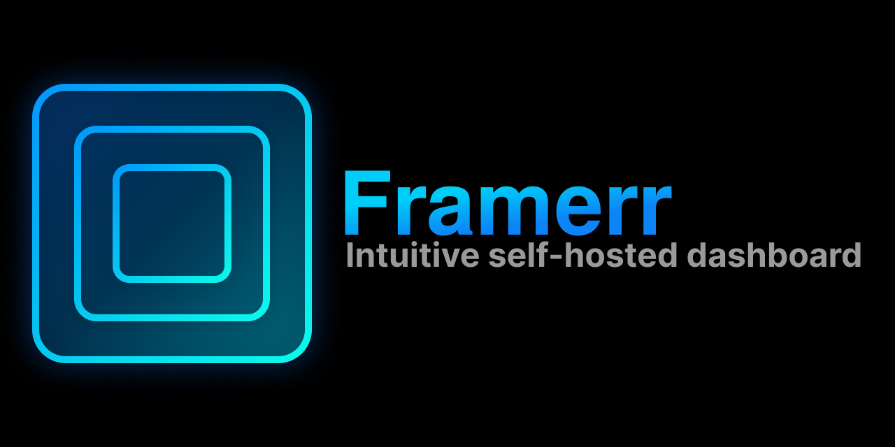
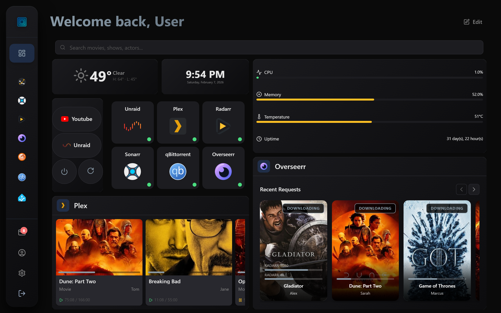
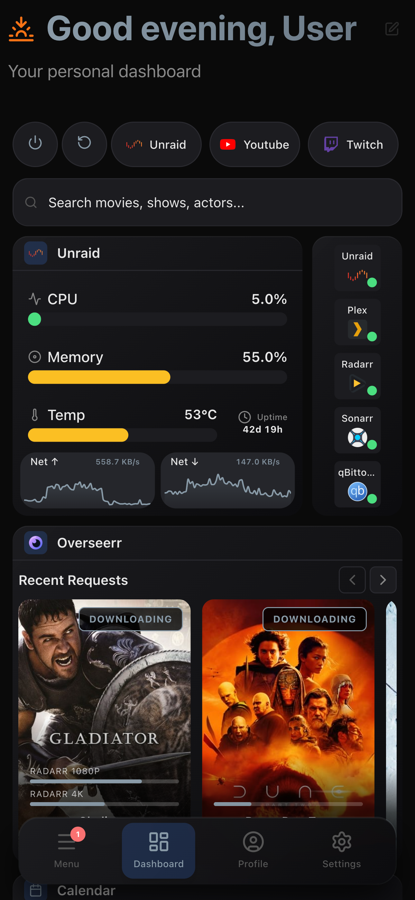

<p align="center">
  
</p>

<p align="center">
  Self-hosted homelab dashboard with iframe tabs, real-time widgets, and Plex SSO.
</p>

<p align="center">
  <a href="https://framerrr.github.io/Framerr/"></a>
  <a href="https://hub.docker.com/r/pickels23/framerr"></a>
  
  <a href="LICENSE"></a>
  <a href="https://buymeacoffee.com/framerr"></a>
</p>

> [!WARNING]
> Framerr is in early development (`0.x.x`). Potentially breaking changes between releases.

📖 **[Documentation](https://framerrr.github.io/Framerr/)** — setup guides, integration docs, and configuration reference.

---

<p align="center">
  
</p>
<h3 align="center">⚡ Powerful, Modern Dashboard</h3>
<p align="center">Real-time widgets, drag-and-drop layout, and deep integration with your homelab services — all in one customizable view.</p>

<p align="center">
  
</p>
<h3 align="center">📱 Responsive Mobile Design</h3>
<p align="center">Dedicated mobile layout with independent widget arrangement and touch-friendly controls. Your dashboard, anywhere.</p>

<h3 align="center">Your homelab. One dashboard. Every user.</h3>
<p align="center">Deep integration and full admin control where it counts. A clean, intuitive experience for the friends and family who share your server. Framerr delivers what you need and what your users want.</p>

## Features

- **Iframe tabs** — embed any web app or service as a tab in the sidebar
- **Real-time widgets** — media streams (Plex, Jellyfin, Emby), Sonarr/Radarr calendars, Overseerr requests, qBittorrent downloads, system stats monitoring, service health monitoring, weather, clock, and more!
- **Plex SSO** — quickly sign into Framerr with your Plex account
- **Auth proxy** — works behind Authelia, Authentik, Nginx Proxy Manager with trusted IP whitelist
- **Customizable** — many built-in themes to choose from, plus a full custom color picker. Make Framerr your own and customize your way!
- **Dashboard templates** — build, save, share, and import/export layouts between users and other Framerr instances. 
- **Drag and drop** — easily rearrange widgets with intuitive mobile and touch support
- **Multi-user** — securely share access to widgets and integrations with friends and family
- **Notifications** — real-time alerts from your integrations, with an in-app notification center and Web Push support
- **Mobile responsive** — dedicated mobile layout with smooth gestures and easy controls
- **Encrypted secrets** — integration API keys and tokens are encrypted at rest with AES-256-GCM


## Quick Start

### Docker Compose

```yaml
services:
  framerr:
    image: pickels23/framerr:latest
    container_name: framerr
    environment:
      - PUID=1000
      - PGID=1000
      - TZ=America/New_York
      - SECRET_ENCRYPTION_KEY=   # Run: openssl rand -hex 32
    volumes:
      - /path/to/appdata/framerr:/config
    ports:
      - 3001:3001
    restart: unless-stopped
```

Generate your encryption key by running `openssl rand -hex 32` in a terminal and paste the output as the value. This key encrypts integration credentials (API keys, tokens) at rest.

Then open `http://localhost:3001` and follow the setup wizard.

### Unraid

An Unraid template is available at [`docs/unraid/Framerr.xml`](docs/unraid/Framerr.xml). Copy it to `/boot/config/plugins/dockerMan/templates/` on your Unraid server, then add the container from the Docker tab.


## Configuration

| Variable | Default | Description |
|----------|---------|-------------|
| `SECRET_ENCRYPTION_KEY` | — | **Required.** Encryption key for integration secrets. |
| `PORT` | `3001` | Application port |
| `PUID` | `0` | User ID for file permissions |
| `PGID` | `0` | Group ID for file permissions |
| `TZ` | `UTC` | Timezone |
| `DATA_DIR` | `/config` | Data directory |

All persistent data (database, uploads, backups) is stored in `/config`.

## Supported Integrations

| Integration | Widget |
|------------|--------|
| Plex / Jellyfin / Emby | Live media streams with progress |
| Sonarr | Upcoming episodes, missing list, episode details with search and grab |
| Radarr | Upcoming movies, missing list, movie details with search and grab |
| Overseerr | Media requesting, request tracking, per-user filtering |
| Tautulli | Server stats and top items |
| qBittorrent | Downloads with torrent controls and transfer stats |
| SABnzbd | Downloads with job management |
| Glances | CPU, memory, disk, network, temperature |
| Unraid | System stats from your Unraid server |
| Uptime Kuma | Service health monitoring |

## Tech Stack

- **Frontend:** React 19, Vite 7, Tailwind CSS 4
- **Backend:** Node.js 20, Express, SQLite
- **Deployment:** Docker (Alpine)

## Development

```bash
git clone https://github.com/pickels23/framerr.git
cd framerr
npm install
cd server && npm install && cd ..
npm run dev:all
```

## Support

If you enjoy Framerr, consider buying me a coffee! ☕

<a href="https://buymeacoffee.com/framerr"></a>

## License

[MIT](LICENSE)
